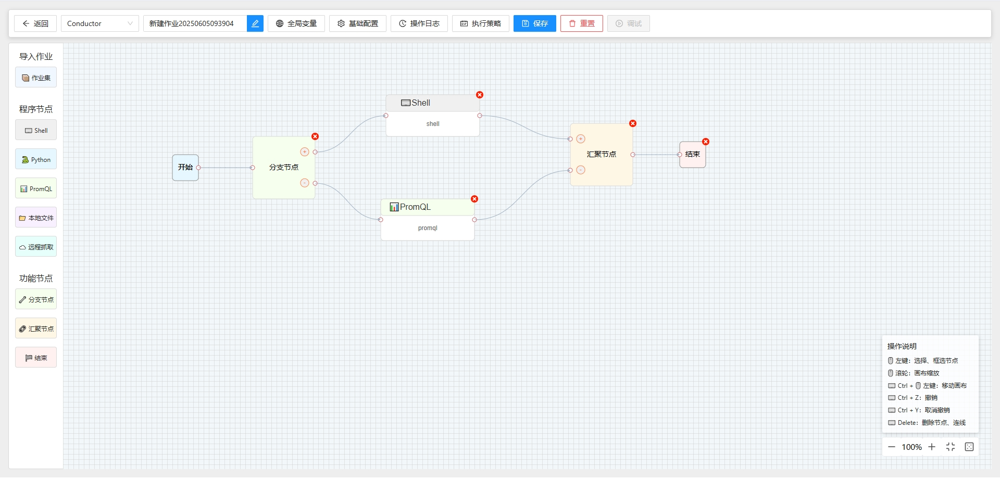

# 工作流编排画布 Demo

## 项目简介

这是一个基于React + TypeScript + Vite的工作流编排画布系统，主要用于可视化创建和管理工作流。

## 主要功能

- 可视化拖拽节点创建工作流
- 支持多种节点类型：Shell、Python、PromQL、LocalFile、RemoteFile
- 工作流执行状态可视化
- 历史任务查看和管理

## 技术栈

- React 18
- TypeScript 5
- Vite 4
- XFlow 图形库

## 快速开始

1. 安装依赖
```bash
npm install
```

2. 启动开发服务器
```bash
npm run dev
```

3. 构建生产版本
```bash
npm run build
```

## 项目结构

```
├── src/
│   ├── pages/
│   │   └── ConductorWorkflowGraph/  # 工作流画布主界面
│   │       ├── components/         # 画布相关组件
│   │       └── index.tsx          # 画布入口
```

## 开发配置

项目使用Vite构建，配置了ESLint进行代码检查。

如需启用更严格的类型检查规则，请参考[ESLint配置说明](#eslint配置)。

## 截图预览


